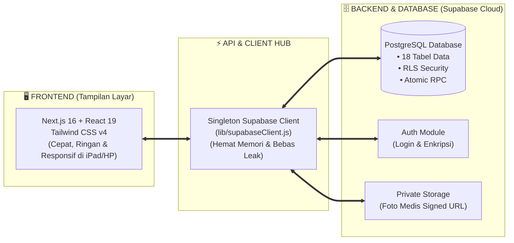
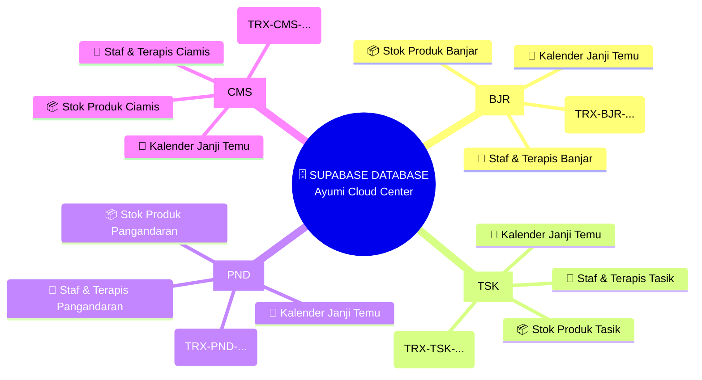
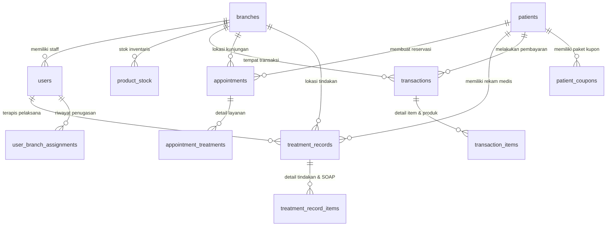
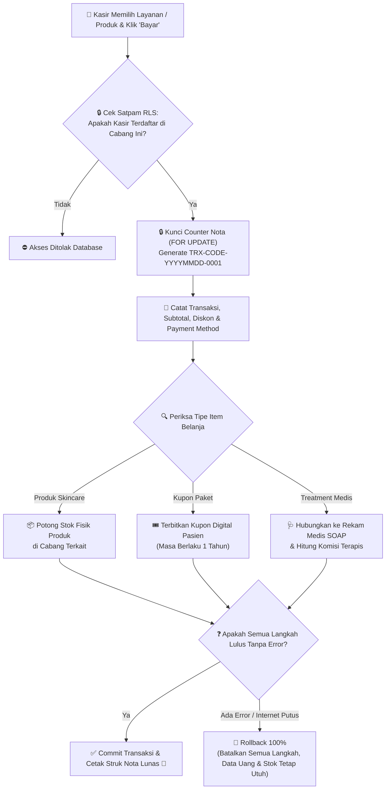

# 🏆 MASTER PANDUAN SISTEM & ARSITEKTUR DATABASE
## Ayumi Beauty House — Multi-Branch Clinic SaaS System

Selamat datang! Dokumen ini adalah **Panduan Master Terlengkap** yang menyatukan seluruh pembahasan mengenai arsitektur sistem, teknologi (*tech stack*), hubungan antar-cabang (*branches*), peta relasi database (*ERD*), alur transaksi kasir, keamanan data, hingga panduan pemilik bisnis (*Owner SOP*) dalam format yang sangat visual dan mudah dipahami.

---

## 🧭 Daftar Isi Utama

1. **🌟 Filosofi & Gambaran Umum Sistem**
2. **🧱 Arsitektur Tech Stack (Frontend, Backend & Database)**
3. **🌐 Mind-Map & Arsitektur Multi-Cabang (`branches`)**
4. **🗄️ Peta Struktur Database & Relasi 18 Tabel (ERD)**
5. **🔄 Simulasi Alur Perjalanan Data Nyata (Data Flow)**
6. **🔒 Keamanan, Satpam RLS & Pencegahan Kecurangan**
7. **💼 Panduan Operasional & Pemeliharaan untuk Owner**

---

## 🌟 Bab 1: Filosofi & Gambaran Umum Sistem

Aplikasi **Ayumi Beauty House** dirancang sebagai sistem perangkat lunak sebagai layanan (*Software-as-a-Service / SaaS*) modern untuk mengelola klinik kecantikan berbasis multi-cabang secara terpusat, presisi, dan aman.

```
┌─────────────────────────────────────────────────────────────────────────┐
│                        👑 OWNER MANAGEMENT                              │
│              (Memantau Seluruh Cabang Secara Real-Time)                 │
└─────────────────────────────────────────────────────────────────────────┘
                                     │
      ┌──────────────────────────────┼──────────────────────────────┐
      ▼                              ▼                              ▼
🏢 Cabang Banjar              🏬 Cabang Tasikmalaya          🏖️ Cabang Pangandaran
[Kasir, Terapis, Stok]        [Kasir, Terapis, Stok]         [Kasir, Terapis, Stok]
```

---

## 🧱 Bab 2: Arsitektur Tech Stack (Bagaimana Semua Terhubung)

Sistem ini dibangun menggunakan 3 pilar teknologi modern kelas dunia:



### 🧩 Peran Masing-Masing Komponen:
1. **Frontend (Next.js 16 & React 19)**: Menampilkan antarmuka yang anggun, responsif di layar iPad/HP kasir dan terapis, serta memuat halaman dalam hitungan milidetik.
2. **Client Hub (`lib/supabaseClient.js`)**: Jembatan terpusat yang menghubungkan aplikasi layar ke server tanpa boros memori.
3. **Backend & Database (Supabase PostgreSQL)**: Otak penyimpanan data 24 jam yang menangani kalkulasi keuangan, keamanan data per cabang, dan foto medis pasien.

---

## 🌐 Bab 3: Mind-Map & Arsitektur Multi-Cabang (`branches`)

Setiap cabang fisik (`Banjar [BJR]`, `Tasikmalaya [TSK]`, `Pangandaran [PND]`, `Ciamis [CMS]`) terhubung secara independen ke Pusat Supabase Database:

### 🧠 Mind-Map Visual Cabang


---

## 🗄️ Bab 4: Peta Struktur Database & Relasi 18 Tabel (ERD)

Database Ayumi Beauty House menggunakan **PostgreSQL** yang terdiri dari 18 tabel utama yang saling terhubung secara utuh:



### 📋 Ringkasan Peran Lemari Data (Tabel) Utama:
- **`branches`**: Master cabang fisik, kode cabang (`BJR`, `TSK`, `PND`, `CMS`), dan target bulanan.
- **`users`**: Data staf, terapis, kasir, admin, dan owner.
- **`patients`**: Profil lengkap pasien, No. WA, dan tanggal lahir.
- **`appointments`**: Kalender janji temu dan reservasi kedatangan.
- **`treatment_records`**: Rekam medis, keluhan SOAP, dan foto *before/after*.
- **`transactions` & `transaction_items`**: Catatan keuangan, struk nota, diskon, dan pembayaran kasir.
- **`products` & `product_stock`**: Master katalog skincare dan stok riil inventaris per cabang.
- **`coupon_packages` & `patient_coupons`**: Master paket kupon hemat dan sisa sesi perawatan pasien.
- **`followup_queue`**: Antrian CRM otomatis pengingat H+3/7/30 dan Ulang Tahun.

---

## 🔄 Bab 5: Simulasi Alur Perjalanan Data Nyata (Data Flow)

Bagaimana transaksi kasir diproses secara **Atomis (All-or-Nothing)** tanpa risiko stok minus atau nota ganda?



---

## 🔒 Bab 6: Keamanan, Satpam RLS & Pencegahan Kecurangan

1. **Satpam Pembatas Cabang (Row Level Security / RLS)**:
   - Staf Kasir Cabang Banjar tidak bisa melihat nota transaksi atau rekam medis Cabang Tasikmalaya.
2. **Proteksi Bentrok Jam Terapis (`trg_check_therapist_overlap`)**:
   - Database menolak pembuatan reservasi baru jika terapis yang dipilih sudah menangani pasien lain di jam yang sama.
3. **Privasi Foto Medis Pasien**:
   - Foto disimpan di *Private Bucket* dan diakses menggunakan **Signed URLs (berlaku 1 jam)**. Foto tidak bisa diintip publik.
4. **Pencegahan Kecurangan Kasir (Fraud Prevention)**:
   - Akun Kasir dilarang menghapus (*DELETE*) nota transaksi yang sudah lunas. Hak hapus nota dikunci khusus untuk akun **Owner**.

---

## 💼 Bab 7: Panduan Operasional & Pemeliharaan untuk Owner

1. **Backup Data Manual Rutin**:
   - Unduh salinan data full dari menu **Pengaturan → Backup & Restore Database** minimal 1x seminggu.
2. **Pengambilan Keputusan Bisnis (Data-Driven)**:
   - Manfaatkan menu **Laporan Treatment** & **Laporan Terapis** untuk melihat menu paling laku dan kontribusi omset per terapis.
3. **Kesiapan Peluncuran Web (Deployment)**:
   - Aplikasi siap di-online-kan menggunakan **Vercel** (gratis) + domain kustom pilihan Anda (misal `app.ayumibeautyhouse.com`).

---

> **Aplikasi Ayumi Beauty House adalah aset digital modern yang rapi, aman, akurat, dan siap menemani kesuksesan ekspansi bisnis klinik kecantikan Anda!** 🚀
