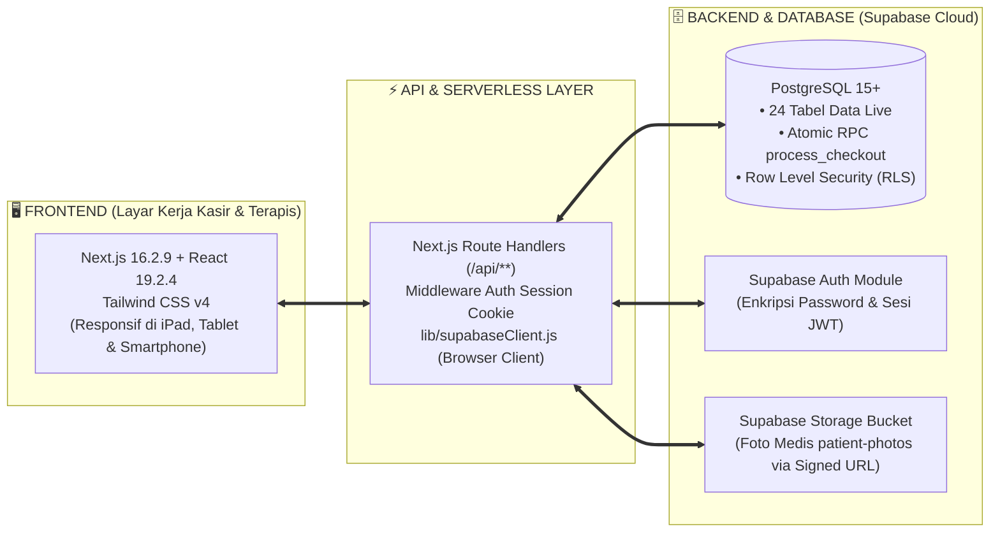
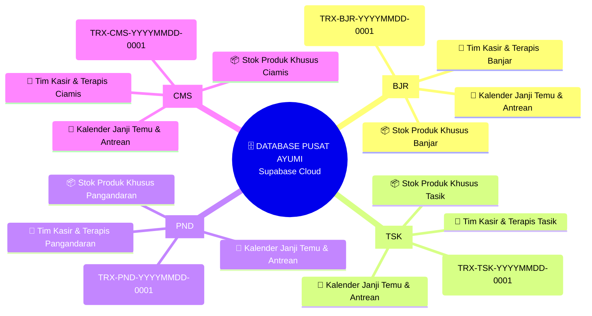
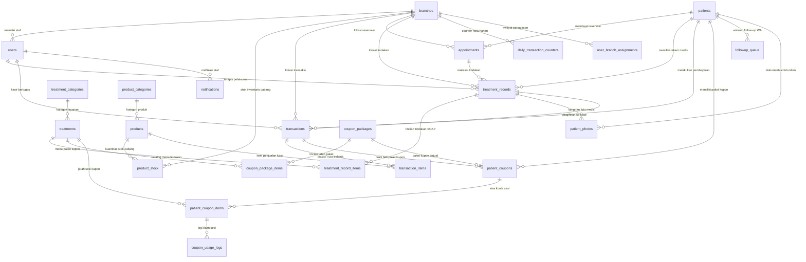

# 🏆 MASTER PANDUAN SISTEM & ARSITEKTUR DATABASE (VERSI 2.0)
## Ayumi Beauty House — Multi-Branch Clinic SaaS System

> **Status Dokumen:** Master Panduan v2.0 (Hasil Sinkronisasi Pasca-Audit Teknis Agustus 2026)  
> **Kondisi Database Live:** 24 Tabel PostgreSQL + 4 Cabang Fisik Aktif (`Banjar`, `Tasikmalaya`, `Pangandaran`, `Ciamis`)  
> **Tech Stack:** Next.js 16.2.9 (App Router) + React 19.2.4 + Tailwind CSS v4, Backend: Supabase Cloud (PostgreSQL, Auth, Storage)

---

## 🧭 Daftar Isi Utama

1. **🌟 Filosofi & Gambaran Umum Sistem**
2. **🧱 Arsitektur Tech Stack & Dependensi Versi Live**
3. **🌐 Arsitektur Multi-Cabang (`branches`)**
4. **🗄️ Peta Struktur Database & Relasi 24 Tabel Live (ERD Lengkap)**
5. **📦 Kamus Lemari Data: Penjelasan 24 Tabel Database**
6. **🔄 Alur Perjalanan Data Transaksi & Pelayanan Medis**
7. **🔒 Keamanan Data, Satpam RLS & Proteksi Akses**
8. **📜 Riwayat Perubahan & Audit Sistem (Agustus 2026)**
9. **❓ Hal-Hal yang Masih Perlu Dikonfirmasi / Uji Berkala**

---

## 🌟 Bab 1: Filosofi & Gambaran Umum Sistem

Aplikasi **Ayumi Beauty House** dirancang sebagai sistem ERP klinik kecantikan multi-cabang terpadu untuk mengelola seluruh aktivitas operasional klinik: mulai dari janji temu pasien, antrean tindakan terapis, rekam medis elektronik (SOAP), kasir Point-of-Sale (POS), inventaris stok produk, paket kupon bundling, hingga otomasi CRM follow-up pasien.

```text
┌─────────────────────────────────────────────────────────────────────────┐
│                        👑 OWNER MANAGEMENT                              │
│              (Memantau Seluruh Cabang Secara Real-Time)                 │
└─────────────────────────────────────────────────────────────────────────┘
                                     │
      ┌──────────────────────────────┼──────────────────────────────┬──────────────────────────────┐
      ▼                              ▼                              ▼                              ▼
🏢 Cabang Banjar              🏬 Cabang Tasikmalaya          🏖️ Cabang Pangandaran          🌾 Cabang Ciamis
[Kasir, Terapis, Stok]        [Kasir, Terapis, Stok]         [Kasir, Terapis, Stok]         [Kasir, Terapis, Stok]
```

---

## 🧱 Bab 2: Arsitektur Tech Stack & Dependensi Versi Live

Sistem dibangun menggunakan 3 pilar teknologi modern:



### 📋 Daftar Dependensi Utama Sistem (Terverifikasi dari `package.json`):
- **Next.js Engine**: `v16.2.9` (App Router)
- **React UI**: `v19.2.4` & `react-dom: v19.2.4`
- **Supabase SDK**: `@supabase/supabase-js: ^2.108.1` & `@supabase/auth-helpers-nextjs: ^0.15.0`
- **Styling**: `tailwindcss: ^4.0` (Tailwind v4 dengan PostCSS)
- **Grafik & Laporan**: `recharts: ^3.8.1`
- **Ekspor Dokumen**: `xlsx: ^0.18.5` (Excel), `jspdf: ^4.2.1` & `html2canvas: ^1.4.1` (PDF)
- **Notifikasi**: `react-hot-toast: ^2.6.0`

---

## 🌐 Bab 3: Arsitektur Multi-Cabang (`branches`)

Setiap cabang klinik fisik terdaftar di tabel `branches` dan memiliki kode cabang unik:
- **Ayumi Banjar** (`BJR` / `c4f02158-...`)
- **Ayumi Tasikmalaya** (`TSK` / `...`)
- **Ayumi Pangandaran** (`PND` / `d61e80db-...`)
- **Ayumi Ciamis (Pusat)** (`CMS` / `6bc44a26-...`)

### 🧠 Mind-Map Operasional per Cabang


---

## 🗄️ Bab 4: Peta Struktur Database & Relasi 24 Tabel Live (ERD)

Database live Ayumi Beauty House terdiri dari **24 tabel relasional** yang terhubung secara terstruktur:



---

## 📦 Bab 5: Kamus Lemari Data (Penjelasan 24 Tabel Database)

Berikut adalah daftar lengkap 24 tabel database live dianalogikan sebagai "Lemari Data":

### A. Lemari Data Inti Klinik & Pasien
1. **`branches` (Lemari Cabang)**: Menyimpan 4 cabang fisik klinik, alamat, telepon, dan target omset bulanan.
2. **`users` (Lemari Pengguna & Staf)**: Menyimpan akun staf klinik, peran (*owner, admin, therapist, cashier*), dan cabang tugas.
3. **`patients` (Lemari Master Pasien)**: Menyimpan 3.960+ profil pasien, nama, tanggal lahir, jenis kelamin, alamat, alergi, dan catatan medis khusus.
4. **`appointments` (Lemari Janji Temu)**: Menyimpan reservasi pasien, jam kedatangan, terapis yang ditugaskan, dan status antrean (*booked, arrived, therapist_ready, in_treatment, completed*).

### B. Lemari Rekam Medis (EMR / SOAP) & Foto Klinis
5. **`treatment_records` (Lemari Rekam Medis SOAP)**: Menyimpan 3.971+ catatan rekam medis dokter/terapis (keluhan, diagnosa kondisi kulit, hasil tindakan, dan rekomendasi produk).
6. **`treatment_record_items` (Lemari Rincian Tindakan)**: Menyimpan rincian layanan treatment yang dikerjakan pada setiap sesi, harga, diskon, dan persentase komisi terapis.
7. **`patient_photos` (Lemari Foto Dokumentasi Medis)**: Menyimpan referensi path foto *before/after* dan kondisi kulit pasien di Supabase Storage (`patient-photos`).

### C. Lemari Menu Layanan & Katalog Produk Skincare
8. **`treatments` (Lemari Menu Treatment)**: Menyimpan 103+ menu perawatan kecantikan, tarif harga, durasi pengerjaan, dan komisi terapis.
9. **`treatment_categories` (Lemari Kategori Treatment)**: Pengelompokan jenis treatment (Facial, Laser, Peeling, Slimming, dll).
10. **`products` (Lemari Katalog Produk)**: Menyimpan 25+ produk skincare, harga beli (HPP), harga jual eceran, dan ambang batas minimum stok.
11. **`product_categories` (Lemari Kategori Produk)**: Klasifikasi produk (Serum, Cream, Toner, Cleanser, Sunscreen).
12. **`product_stock` (Lemari Stok Inventaris per Cabang)**: Menyimpan kuantitas fisik stok produk yang tersedia di masing-masing cabang.

### D. Lemari Transaksi Kasir & Finansial (POS)
13. **`transactions` (Lemari Nota Transaksi Kasir)**: Menyimpan faktur pembayaran, total belanja, potongan diskon, metode bayar (*Cash, Transfer, QRIS, Debit, Split Payment*), dan kasir yang bertugas.
14. **`transaction_items` (Lemari Rincian Struk Belanja)**: Menyimpan rincian setiap produk, treatment, atau paket kupon yang dibeli dalam sebuah nota transaksi.
15. **`daily_transaction_counters` (Lemari Counter Nota Harian)**: Pengunci penomoran nota urut per cabang per hari agar tidak ada nomor struk kembar.

### E. Lemari Paket Kupon Treatment Multi-Sesi
16. **`coupon_packages` (Lemari Master Paket Kupon)**: Katalog bundling treatment hemat multi-sesi (misal: *Paket Glowing 5x Sesi*).
17. **`coupon_package_items` (Lemari Rincian Paket Kupon)**: Jatah kuota tindakan per treatment di dalam paket.
18. **`patient_coupons` (Lemari Kupon Milik Pasien)**: Kupon aktif yang sudah dibeli oleh pasien, masa berlaku, dan status (*active, completed, expired*).
19. **`patient_coupon_items` (Lemari Sisa Kuota Sesi Pasien)**: Pelacak sisa sesi tindakan yang masih bisa diklaim pasien (*remaining_sessions*).
20. **`coupon_usage_logs` (Lemari Riwayat Klaim Kupon)**: Catatan histori tanggal, jam, dan cabang saat pasien menggunakan sisa sesi kuponnya.

### F. Lemari CRM, Notifikasi & Audit Staf
21. **`followup_queue` (Lemari Antrean Follow-up WhatsApp CRM)**: 1.024+ antrean pengingat otomatis untuk follow-up kepuasan H+3, perawatan ulang H+14/H+30, dan ucapan ulang tahun.
22. **`notifications` (Lemari Notifikasi Sistem)**: Notifikasi real-time di header aplikasi untuk kasir dan terapis.
23. **`user_branch_assignments` (Lemari Riwayat Perpindahan Cabang)**: Log audit mutasi/penugasan staf dari satu cabang ke cabang lain.
24. **`audit_logs` (Lemari Audit Log Keamanan)**: Catatan rekam jejak aktivitas penting dan penghapusan data.

---

## 🔄 Bab 6: Alur Perjalanan Data Transaksi & Pelayanan Medis

```text
[1. PASIEN DATANG] ───► Dicatat di 'appointments' (Status: Arrived)
                             │
                             ▼
[2. RUANG TINDAKAN] ──► Terapis klaim di '/therapist/dashboard'
                             │
                             ▼
[3. INPUT REKAM MEDIS]► Isi SOAP, foto kamera live, simpan ke 'treatment_records'
                             │
                             ▼
[4. KASIR & POS] ─────► Buka tagihan pending di '/kasir', terapkan diskon/kupon
                             │
                             ▼
[5. BAYAR ATOMIS] ────► Eksekusi RPC 'process_checkout':
                        - Nota tersimpan di 'transactions'
                        - Stok terpotong di 'product_stock'
                        - Sesi kupon terupdate
                             │
                             ▼
[6. CETAK STRUK] ─────► Print nota thermal / PDF untuk pasien
                             │
                             ▼
[7. OTOMASI CRM] ─────► Masuk 'followup_queue' untuk WA H+3 kepuasan
```

---

## 🔒 Bab 7: Keamanan Data & Proteksi Akses (Status Hasil Audit)

### 🟢 FAKTA YANG SUDAH TERVERIFIKASI AMAN:
1. **Kredensial Server**: Kunci rahasia `SUPABASE_SERVICE_ROLE_KEY` disimpan aman di backend Node.js dan tidak pernah terekspos ke browser publik.
2. **Foto Medis Pasien**: Diunggah ke storage terisolasi dan diakses secara privat menggunakan **Signed URL berdurasi 1 jam (3600 detik)**.
3. **Pemberian Hak Akses Terapis**: Nomor WhatsApp pasien disaring ketat di level API server sehingga terapis tidak bisa melihat nomor kontak pribadi pasien.
4. **Transaksi Kasir Atomis**: Pembuatan nota dan pemotongan stok cabang dieksekusi secara aman di dalam database via PostgreSQL RPC `process_checkout` dengan *Row-Level Locking*.

### 🟡 KLAIM / REKOMENDASI YANG PERLU DIPERKUAT:
1. **Row Level Security (RLS) PostgreSQL**: Filter cabang saat ini sebagian besar diterapkan di JavaScript frontend. Diperlukan penegakan RLS ketat di database agar data omset antar cabang tidak bisa dibaca melalui console browser.
2. **Kompresi Foto Client-Side**: Disarankan menambahkan kompresi otomatis WebP 1600px di browser sebelum upload foto klinis dari galeri agar menghemat kapasitas storage hingga 13 kali lipat.

---

## 📜 Bab 8: Riwayat Perubahan & Audit Sistem (Agustus 2026)

| Tanggal | Tahap Perubahan / Audit | Rincian Tindakan |
| :--- | :--- | :--- |
| **17 Agu 2026** | **Audit Teknis Komprehensif** | Pemetaan codebase, audit keamanan kredensial, audit integritas database, audit alur transaksi kasir, dan audit performa skalabilitas 10 tahun. |
| **17 Agu 2026** | **Penyempurnaan Modul Terapis** | Penambahan akses kamera WebRTC live capture, penghapusan emoji slop, penyembunyian WhatsApp pasien untuk terapis, dan modal riwayat medis pasien lintas cabang. |
| **17 Agu 2026** | **API Route Khusus Terapis** | Pembuatan endpoint `/api/therapist/patient-lookup` dan `/api/therapist/patient-history` untuk mengatasi isolasi data RLS antar cabang. |
| **17 Agu 2026** | **Pembaruan Panduan Master v2.0** | Pemutakhiran seluruh dokumentasi dari 18 tabel menjadi 24 tabel live, diagram ERD lengkap, dan panduan operasional terkini. |

---

## ❓ Bab 9: Hal-Hal yang Masih Perlu Dikonfirmasi / Uji Berkala

1. **Uji Coba Restore Backup Mandiri**: Jadwalkan uji coba unduh file backup SQL dan coba restore ke database pengujian minimal 1× setahun untuk memastikan file backup valid.
2. **Pembersihan Baris Yatim Historis**: Jalankan skrip pemetaan 12 item transaksi historis lama yang belum memiliki `product_id` agar laporan riwayat produk lampau 100% sinkron.
3. **Monitoring Tagihan Supabase Bulanan**: Pantau grafik penggunaan *Storage* dan *Database Egress* di Supabase Dashboard setiap akhir bulan.
